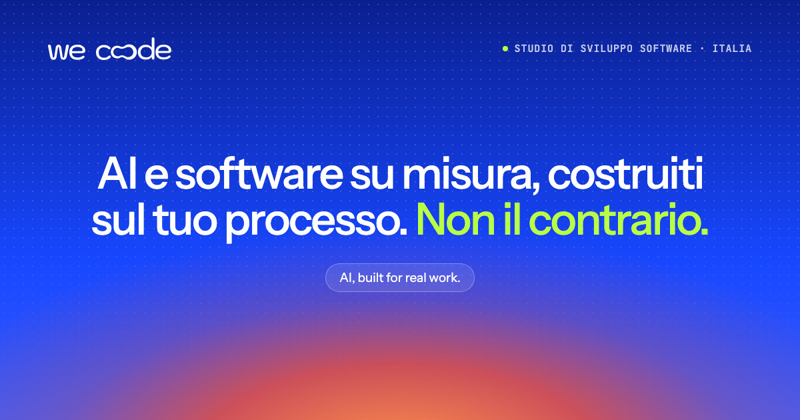

  &nbsp;
  <a href="https://www.linkedin.com/company/wecoodestudio"><picture><source media="(prefers-color-scheme: dark)" srcset="./assets/btn-linkedin-dark.svg"></picture></a>&nbsp;
  <a href="https://www.instagram.com/wecoode/"><picture><source media="(prefers-color-scheme: dark)" srcset="./assets/btn-instagram-dark.svg"></picture></a>&nbsp;
  <a href="mailto:hello@wecoode.it"><picture><source media="(prefers-color-scheme: dark)" srcset="./assets/btn-email-dark.svg"></picture></a>

# We Coode

**Studio di sviluppo software.** Costruiamo software su misura, AI agents e automazioni per i processi delle aziende.

Chi decide il progetto è chi scrive il codice: niente account manager in mezzo, niente passaggi di mano. Seguiamo il ciclo completo, dall'analisi e architettura al design, fino allo sviluppo in sprint settimanali.

> _Software che segue il processo. Non il contrario._

## Cosa facciamo

| | |
| --- | --- |
| **[AI Agents & Automazione](https://wecoode.it/servizi/agenti-ai)** | Agent collegati ai dati e agli strumenti già in uso, con una persona che valida le decisioni. Non chatbot generici. |
| **[Software gestionale su misura](https://wecoode.it/servizi/sviluppo-software-su-misura)** | Quando il processo gira su Excel, email e copia-incolla, lo trasformiamo in software costruito su come lavori davvero. |
| **[Sviluppo web e mobile](https://wecoode.it/servizi/sviluppo-web)** | Web app, piattaforme e app cross-platform in React Native, pubblicate su App Store e Google Play. |
| **[Integrazioni](https://wecoode.it/soluzioni/integrazione-software-aziendale)** | API, middleware e sincronizzazione dei dati tra sistemi che oggi non si parlano. |
| **[Fractional CTO](https://wecoode.it/servizi/fractional-cto)** | Direzione tecnica senior part-time, per chi ne ha bisogno ma non può assumere un CTO. |

Tutti i servizi: [wecoode.it/servizi](https://wecoode.it/servizi)

## Stack

Stack standard, non proprietario: qualunque team senior può subentrare senza reverse engineering.

| Area | Tecnologie |
| --- | --- |
| **Frontend** | TypeScript · React · Next.js · Tailwind CSS · Motion |
| **Mobile** | React Native · Expo |
| **Backend** | Node.js · Express · GraphQL · Python · PHP |
| **Dati** | PostgreSQL · MySQL · MongoDB · Redis · Prisma · Supabase |
| **AI** | Claude · OpenAI · Vercel AI SDK · LangChain · LangGraph · MCP · RAG |
| **Cloud e DevOps** | AWS · Lambda · Vercel · Cloudflare · Docker · GitHub Actions |
| **Qualità e monitoraggio** | Vitest · Playwright · Sentry · OpenTelemetry |
| **Integrazioni** | Stripe · Shopify · Zapier · Payload CMS · WordPress |
| **Web3** | Cardano · Aiken · Mesh SDK · Ethereum · Ethers |
| **Design** | Figma |

## Il team

<table>
  <tr>
    <td align="center" width="50%">
       
      <b>Lorenzo Marcolli</b> 
      CO-FOUNDER · TECHNICAL DIRECTOR 
      Frontend, architettura UI, design system 
      <a href="https://www.linkedin.com/in/lorenzo-marcolli/">LinkedIn</a>
    </td>
    <td align="center" width="50%">
       
      <b>Alberto Rizzi</b> 
      CO-FOUNDER · STRATEGY & OPERATIONS 
      Backend, integrazioni, infrastruttura 
      <a href="https://www.linkedin.com/in/albertorizzi/">LinkedIn</a>
    </td>
  </tr>
</table>

## Parliamo del tuo caso d'uso

Scrivici a **[hello@wecoode.it](mailto:hello@wecoode.it)** o usa il [form contatti](https://wecoode.it/contatti). Nel primo messaggio raccontaci il processo da coprire, i sistemi che usi già e la tempistica.

  <a href="mailto:hello@wecoode.it"><picture><source media="(prefers-color-scheme: dark)" srcset="./assets/btn-email-dark.svg"></picture></a>

---

<b>English</b>

 

**A software development studio.** We build custom software, AI agents and automation for real business processes.

The people who make the decisions are the people who write the code: no account managers in between, no handoffs. We cover the full cycle, from analysis and architecture to design and engineering in weekly sprints.

> _Software that follows the process. Not the other way around._

### What we do

| | |
| --- | --- |
| **[AI Agents & Automation](https://wecoode.it/en/services/ai-agents)** | Agents wired into the data and tools you already use, with a person approving the decisions. Not generic chatbots. |
| **[Custom Business Software](https://wecoode.it/en/services/custom-software-development)** | When a process runs on spreadsheets, email and copy-paste, we turn it into software built around how you actually work. |
| **[Web & Mobile Development](https://wecoode.it/en/services/web-development)** | Web apps, platforms and cross-platform React Native apps, shipped to the App Store and Google Play. |
| **[System Integration](https://wecoode.it/en/solutions/enterprise-software-integration)** | APIs, middleware and data sync between systems that don't talk to each other today. |
| **[Fractional CTO](https://wecoode.it/en/services/fractional-cto)** | Senior part-time technical leadership, for teams that need it but can't hire a full-time CTO. |

All services: [wecoode.it/en/services](https://wecoode.it/en/services)

### Stack

A standard, non-proprietary stack: any senior team can take over without reverse engineering. See the table above.

### Let's talk about your use case

Write to **[hello@wecoode.it](mailto:hello@wecoode.it)** or use the [contact form](https://wecoode.it/en/contact). In your first message, tell us the process you want to cover, the systems you already use and your timeline.

AI, built for real work.

